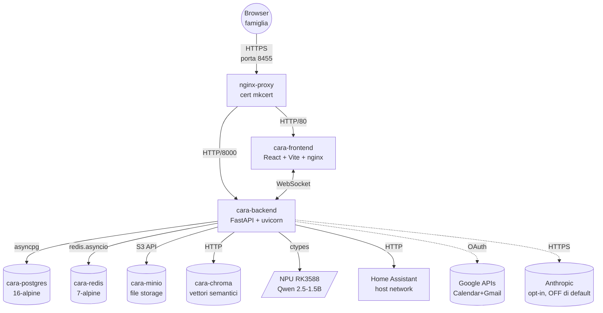
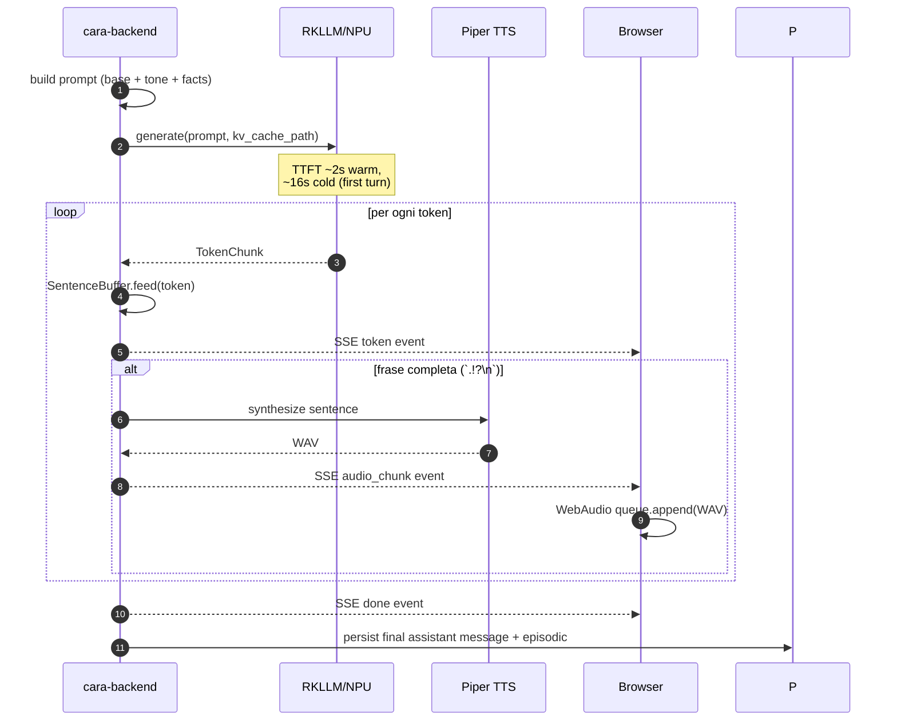

# Cap 1 — Architettura

> *Sintesi 30 secondi.* CARA è composta da sei container Docker che
> girano su un NanoPC-T6: un backend FastAPI, un frontend React,
> Postgres, Redis, MinIO, ChromaDB. Il backend usa la NPU del processore
> per far girare un modello AI locale. Tutti i container parlano fra
> loro su una rete privata, e un nginx-proxy esterno gestisce HTTPS.
> Questo capitolo descrive ogni pezzo e come si combinano.

## 1.1 Vista d'insieme

**Lettura del diagramma**: i nodi a forma di cilindro sono storage,
quelli rettangolari sono container applicativi. Le frecce solide sono
connessioni sempre attive, quelle tratteggiate sono opt-in.

Il punto di entrata è sempre **nginx-proxy** sulla porta 8455 (HTTPS).
nginx-proxy non gira in `cara-frontend` — è un container separato
condiviso con altri servizi della casa (Pi-hole, Frigate, Home
Assistant). Vedi `/home/apedo/CLAUDE.md` per la mappa completa.

## 1.2 Stack tecnologico

| Strato | Tecnologia | Versione | File principale |
|---|---|---|---|
| OS host | Debian 11 bullseye + kernel custom 6.1.141-cara1 | — | — |
| Hardware | NanoPC-T6 (RK3588, 16GB RAM) | — | — |
| Orchestrazione | Docker + Docker Compose v2 | 20.10.5 | `/opt/cara/docker-compose.yml` |
| Backend lang | Python | 3.11 | `backend/pyproject.toml` |
| Backend framework | FastAPI + uvicorn + asyncio | 0.115+ | `backend/cara/main.py` |
| Backend ORM | SQLAlchemy async + asyncpg + Alembic | 2.x | `backend/cara/store/db.py` |
| Frontend lang | TypeScript | 5.7 | `frontend/tsconfig.json` |
| Frontend framework | React 18 + react-router-dom | 18.3 | `frontend/src/App.tsx` |
| Frontend build | Vite + vite-plugin-pwa | 5.4 | `frontend/vite.config.ts` |
| Frontend CSS | Tailwind CSS | 3.4 | `frontend/tailwind.config.ts` |
| Database | Postgres | 16-alpine | container `cara-postgres` |
| Cache + pub/sub | Redis | 7-alpine | container `cara-redis` |
| Object storage | MinIO (S3 compat) | latest | container `cara-minio` |
| Vector DB | ChromaDB | 0.5.23 | container `cara-chroma` |
| AI runtime | RKLLM (Rockchip) | 1.1.0 | `librkllmrt.so` bind-mount |
| Modello LLM | Qwen 2.5-1.5B w8a8 hybrid-0.5 | — | `data/models/*.rkllm` |
| TTS | Piper | latest | `cara/ai/tts/` |
| STT | Whisper (server) + Web Speech (client) | — | `cara/api/v1/asr.py` |
| Embeddings | sentence-transformers/paraphrase-multilingual-MiniLM-L12-v2 | 384-d | `cara/ai/embeddings.py` |
| OCR | Tesseract + OpenCV | latest | `cara/ai/ocr.py` |
| Reverse proxy | nginx | alpine | `/opt/nginx-proxy/` |

## 1.3 I container Docker

Sei container compongono CARA. Si avviano con
`docker compose --profile app up -d` da `/opt/cara/`.

### cara-backend
- Immagine: `cara-backend:0.1.0` (build locale dal `Dockerfile`)
- Linguaggio: Python 3.11
- Cosa fa: serve l'API REST `/api/v1/*`, gestisce gli scheduler
  (push, calendar, gmail, proattività, smart home events), accede
  alla NPU per la generazione LLM
- Porte: 8000 (interna)
- IP statico: `172.31.0.21`
- Mount importanti:
  - `/dev/dri/card0` per accesso DRM alla NPU
  - `data/models/` per il modello LLM
  - `runtime-v1.1.0/lib/librkllmrt.so` per la libreria runtime RKLLM
- Group add: `["44"]` (gruppo `video` per accesso a `/dev/dri`)
- Healthcheck: `curl http://localhost:8000/health`

> **🔒 Sicurezza** — il container ha accesso al device hardware
> `/dev/dri/card0` per usare la NPU. Questa è la concessione di
> sicurezza più forte di tutto lo stack.

### cara-frontend
- Immagine: `cara-frontend:0.1.0` (build a due stadi: Vite poi nginx)
- Linguaggio: TypeScript / HTML
- Cosa fa: serve gli asset statici (HTML, JS, CSS, immagini, manifest,
  service worker) e fa proxy `/api/*` a `cara-backend:8000`
- Porte: 80 (interna)
- IP statico: `172.31.0.20`
- Healthcheck: `wget -qO- http://localhost/`

### cara-postgres
- Immagine: `postgres:16-alpine`
- Cosa fa: tutta la persistenza relazionale (utenti, conversazioni,
  task, fact, eventi, settings, audit, ...)
- Porte: 5432 (interna, mai esposta)
- IP statico: `172.31.0.19`
- Volume: `data/postgres/`

### cara-redis
- Immagine: `redis:7-alpine`
- Cosa fa: cache (response cache, embeddings cache, weather cache,
  TTS cache), pub/sub per il family bus, rate limiting CDA, ticket
  pairing dei device
- Porte: 6379 (interna)
- IP statico: `172.31.0.18`
- Volume: `data/redis/` (persistenza opzionale)

### cara-minio
- Immagine: `quay.io/minio/minio`
- Cosa fa: file storage S3-compatibile per upload utente (foto
  scontrini, documenti). Il backend interagisce via boto3.
- Porte: 9000 (API), 9001 (console)
- IP statico: `172.31.0.17`
- Volume: `data/minio/`

### cara-chroma
- Immagine: `chromadb/chroma:0.5.23`
- Cosa fa: ricerca vettoriale per la memoria semantica e CDA. NB:
  attualmente CARA usa SQLAlchemy + JSONB per gli embedding di
  family-scale (≤10k facts), ChromaDB è usato solo dal CDA per
  caching del KB.
- Porte: 8000 (interna)
- IP statico: `172.31.0.16`
- Volume: `data/chroma/`

### cara-celery (opzionale)
- Immagine: `cara-backend:0.1.0` (stessa del backend, comando diverso)
- Cosa fa: worker asincrono per task pesanti — al momento praticamente
  inutilizzato perché tutto sta in scheduler asyncio dentro `cara-backend`
- IP: dinamico

## 1.4 Rete

Tutti i container CARA stanno sulla rete Docker `proxy-net`. Non
hanno propri network — ogni service ha solo `proxy-net` (vedi
`docker-compose.yml`).

### Perché un solo network per service

Docker daemon 20.10.5 (la versione installata sul NanoPC) **non
supporta** più network in singolo `docker create`. Compose v5.x lo
richiederebbe per default. La soluzione: ogni service nel
docker-compose.yml ha un solo network nel block `networks:`.

> **⚠️ Attenzione** — non aggiungere mai un secondo network ai
> service CARA. Romperebbe il deploy. Se un container ha bisogno di
> parlare con uno fuori da `proxy-net`, usa l'IP del gateway
> (`172.31.0.1` per Home Assistant in `network_mode: host`).

### Indirizzi IP statici

| Container | IP `proxy-net` |
|---|---|
| nginx-proxy | 172.31.0.5 |
| Pi-hole | 172.31.0.15 |
| WireGuard | 172.31.0.10 |
| Frigate | 172.31.0.11 |
| cara-chroma | 172.31.0.16 |
| cara-minio | 172.31.0.17 |
| cara-redis | 172.31.0.18 |
| cara-postgres | 172.31.0.19 |
| cara-frontend | 172.31.0.20 |
| cara-backend | 172.31.0.21 |

### Porte esposte all'host

`nginx-proxy` mappa la maggior parte delle porte. CARA in particolare:

| Servizio | URL esterna | Mappa interna |
|---|---|---|
| CARA (HTTPS) | `https://192.168.1.23:8455/` | → `cara-frontend:80` |
| API CARA | `https://192.168.1.23:8455/api/*` | → `cara-backend:8000` |
| WebSocket | `wss://192.168.1.23:8455/api/v1/family/ws` | → `cara-backend:8000` |
| CA download (HTTP) | `http://192.168.1.23/cara-ca.crt` | → file su nginx host |

## 1.5 Storage — dove vivono i dati

| Tipo di dato | Dove | Backup? |
|---|---|---|
| Utenti, password (hashate) | Postgres `users` | sì, `scripts/backup-postgres.sh` |
| Conversazioni chat | Postgres `conversations` + `messages` | sì |
| Task, spesa, note | Postgres `tasks`, `shopping_items`, `notes` | sì |
| Eventi episodici (chat turn, router miss, ecc.) | Postgres `events` | sì |
| Fatti semantici (allergie, preferenze) | Postgres `facts` (con embedding JSONB) | sì |
| Audit log | Postgres `audit_log` | sì |
| Skill JSON | Postgres `skills` | sì |
| Layout wallet, dispositivi paired | Postgres `wallet_layouts`, `devices` | sì |
| Settings flag | Postgres `admin_settings` | sì |
| Modello LLM (.rkllm, ~1.9GB) | filesystem `data/models/` | no, riscaricabile |
| Voci Piper TTS (.onnx) | filesystem `data/tts/piper/voices/` | no, riscaricabili |
| Cache modelli HuggingFace (Whisper) | filesystem `data/whisper-cache/` | no |
| Upload file utente (foto, doc) | MinIO bucket `cara-uploads` | sì raccomandato |
| Cache risposte chat | Redis (TTL 5 min, perdibile) | no |
| Cache embeddings | Redis (TTL 24h) | no |
| KV cache RKLLM | filesystem `cache/kv/<sha1>.bin` | no, ricostruibile |
| Token VAPID, OAuth keys | `.env` | sì raccomandato (ma sono regenerabili) |

> **💡 Suggerimento** — il backup minimo per ripristinare CARA è il
> dump di Postgres + il `.env`. Il modello LLM e le voci Piper si
> riscaricano da Internet. Gli upload utente vanno backuppati a parte
> (MinIO espone una S3 API standard).

## 1.6 Cosa succede quando arriva una richiesta chat

Sequenza completa di una chat dal momento in cui Antonio digita "che
ore sono?" al momento in cui sente la risposta. Questa è la sequenza
più importante da capire — tocca quasi tutti i moduli di CARA.

```mermaid
sequenceDiagram
    autonumber
    participant U as Browser Antonio
    participant N as nginx-proxy
    participant F as cara-frontend
    participant B as cara-backend
    participant P as Postgres
    participant R as Redis
    participant L as RKLLM/NPU
    participant T as Piper TTS

    U->>N: HTTPS POST /api/v1/chat
    N->>B: HTTP /api/v1/chat
    B->>P: load conversation history
    B->>B: Pipeline route_chat_request
    Note over B: Tier-1: skill dispatcher<br/>Tier-2: recipe chain<br/>Tier-3: intent router
    B->>B: intent_router → "answer_datetime"
    B->>P: persist user message
    B->>P: persist assistant message
    B->>R: publish family.bus
    B-->>N: SSE meta + token + done
    N-->>U: SSE stream
    U->>U: Render token come testo
    U->>N: GET /api/v1/voice/synthesize
    N->>B: voice synthesize
    B->>R: cache lookup
    alt cache miss
        B->>T: Piper synthesize
        T-->>B: WAV bytes
        B->>R: cache write (TTL 1h)
    end
    B-->>U: WAV
    U->>U: Audio play (WebAudio)
```

Per messaggi **non-deterministici** (cioè non gestiti dai 3 tier
deterministici), il flow continua dopo lo step 6:

I numeri di TTFT (time-to-first-token) sono critici. Il primo turno di
una conversazione è cold (~16 secondi); dal secondo in poi la KV cache
è scritta e ricaricata, scendendo a ~2 secondi. Vedi cap 6.3.

## 1.7 Il ciclo di vita del backend

Quando `cara-backend` parte, il `lifespan` async di FastAPI (definito
in `cara/main.py`) esegue questa sequenza:

1. Crea l'engine SQLAlchemy + sessionmaker.
2. Inizializza Redis client.
3. **Carica il modello LLM** sulla NPU (~6 secondi).
4. Inizializza il servizio TTS Piper.
5. Avvia il bot Telegram (se configurato).
6. Avvia la state machine FSM (idle → listening → thinking → speaking → idle).
7. Avvia il manutentore CDA (pulizia KB).
8. Avvia lo scheduler push (se VAPID configurato).
9. Avvia lo scheduler proattività (se push configurato).
10. Avvia il subscriber WebSocket Home Assistant (sempre, riconnette
    da solo se HA non c'è).
11. Avvia gli scheduler Calendar + Gmail (se OAuth Google configurato).
12. Application startup completo, uvicorn accetta richieste.

Lo shutdown inverte: cancella tutti i task asyncio, ferma il bot
Telegram, scarica il modello, chiude le connessioni DB, e termina.

## 1.8 Differenze fra ambiente di sviluppo e produzione

In sviluppo (sul NanoPC-T6 di Antonio):
- `CARA_ENV=development` (vedi `cara/config.py`)
- Swagger esposto a `/api/docs`
- `OPENAPI_URL=/api/openapi.json` esposto
- Cert self-signed (con CA mkcert installata sui device famiglia)
- Logs strutturati a stdout, livello DEBUG/INFO

In produzione (configurazione futura):
- `CARA_ENV=production`
- Swagger e OpenAPI **disabilitati** (`docs_url=None`, `openapi_url=None`)
- Cert Let's Encrypt o CA aziendale
- Logs a livello WARNING+, possibilmente forwardati a un collector

L'unico ambiente "produzione" oggi è proprio quello di Antonio: una
famiglia di 4 persone in casa. Il design supporta scale-up al limite
hardware del NanoPC (~10 utenti concorrenti, single LLM worker).

---

[← Cap 0 Prefazione](00-prefazione.md) · [README](README.md) · [Cap 2 Setup ambiente →](02-setup-ambiente.md)
