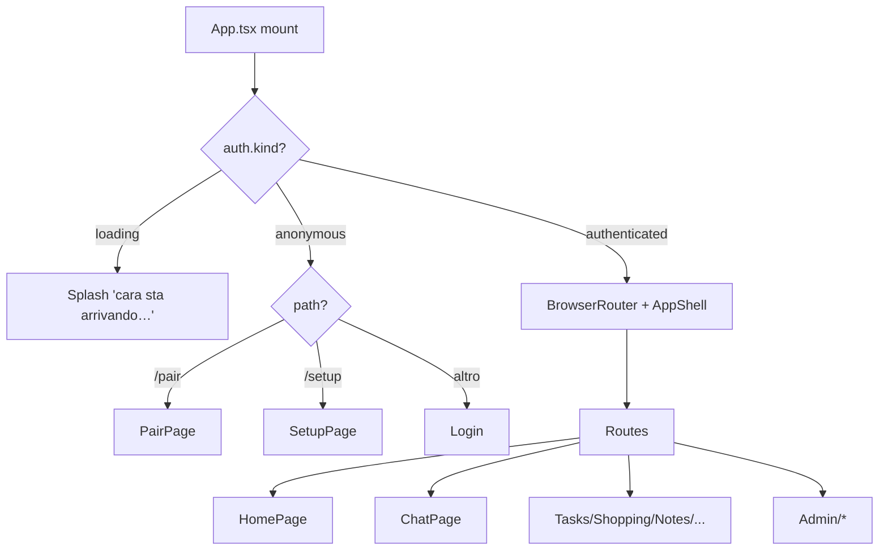

# Cap 5 — Frontend, moduli profondi

> *Sintesi 30 secondi.* Il frontend è React 18 + TypeScript + Vite +
> Tailwind, organizzato in `frontend/src/` con cartelle separate per
> API client, componenti, design system, librerie di utilità, route e
> store. È una PWA installabile con service worker custom. Questo
> capitolo spiega come è strutturato e dove vivere ogni cosa.

## 5.1 Stack frontend

| Strato | Tecnologia | Versione |
|---|---|---|
| Linguaggio | TypeScript | 5.7 |
| Framework | React | 18.3 |
| Bundler | Vite | 5.4 |
| Routing | react-router-dom | 6.28 |
| CSS | Tailwind CSS | 3.4 |
| PWA | vite-plugin-pwa (injectManifest) | 0.21 |
| Service Worker | Workbox + custom | 7.4 |
| Audio streaming | hls.js | 1.6 |
| Test E2E | @playwright/test | 1.49 |

**Niente Redux, niente MobX**: lo state vive in component state
(`useState`, `useReducer`) o Context Providers per ciò che è davvero
globale (auth, theme, toasts).

**Niente CSS framework oltre Tailwind**: nessuna libreria di
componenti tipo Material-UI o shadcn. Il design system di CARA è
custom (vedi 5.3).

## 5.2 Routing — `App.tsx` + `AppShell`

`App.tsx` è il punto di ingresso. Decide cosa renderizzare in base
allo stato di autenticazione:



**`AppShell`** è il layout principale per gli utenti loggati: nav
laterale (rail), top bar, area outlet. Un solo file:
`components/AppShell.tsx`.

La route table è in `App.tsx:160+`:

```tsx
<Routes>
  <Route path="/" element={<AppShell ... />}>
    <Route index element={<HomePage />} />
    <Route path="chat" element={<ChatPage />} />
    <Route path="tasks" element={<TasksPage />} />
    {/* ... ~25 route */}
    <Route path="admin/skills" element={<AdminSkillsPage />} />
    <Route path="admin/setup" element={<SetupPage />} />
    <Route path="setup" element={<SetupPage />} />
    <Route path="pair" element={<PairPage />} />
    <Route path="*" element={<Navigate to="/" replace />} />
  </Route>
</Routes>
```

**Aggiungere una route nuova**:
1. Crea `frontend/src/routes/FooPage.tsx` come functional component.
2. Aggiungi l'import in `App.tsx`.
3. Aggiungi `<Route path="foo" element={<FooPage />} />` nella sezione
   AppShell (per pagine autenticate) o fuori (per anonime tipo `/pair`).
4. Se serve nav nel rail: edita `components/AppShell.tsx` aggiungendo
   un `NavEntry` in `MAIN_NAV` o `SECONDARY` o `ADMIN_ENTRIES`.

> **💡 Suggerimento** — le route `/admin/*` sono autoprotette dal
> `AdminPage` (redirect a `/chat` se `!user.is_admin`); le sub-route
> ereditano questo. Se aggiungi una `/admin/x`, la sicurezza è già
> automatica.

## 5.3 Design system — `frontend/src/design/`

**Cosa fa**: paletta colori, tipografia, primitive UI riutilizzabili,
icone SVG inline. Condiviso da tutte le pagine.

### `design/tokens.ts`

Definisce **valori semantici** (nome → colore/spacing) per tema day e
night. Il `ThemeProvider` espone i token al runtime; Tailwind ne usa i
nomi in `tailwind.config.ts`.

Esempi di token:

```typescript
export const tokens = {
  day: {
    bg: '#FAF7F2',        // avorio caldo
    fg: '#2A2A2A',
    accent: '#D17C4F',    // terracotta
    sage: '#8FA889',      // sage muted
    // ...
  },
  night: {
    bg: '#0F1B2D',        // blu notte
    fg: '#F1E9D8',
    accent: '#E8B65C',    // ambra
    // ...
  },
}
```

### `design/components/`

Sette primitive UI:

| File | Uso |
|---|---|
| `Button.tsx` | Pulsante primario/secondario, varianti tonal |
| `Card.tsx` | Container con border-radius e ombra coerenti |
| `Input.tsx` | Input testo con label semantico |
| `Toast.tsx` | Notifica temporanea + ToastProvider context |
| `BottomSheet.tsx` | Pannello mobile-first che scivola dal basso |
| `Badge.tsx` | Etichetta colorata piccola |
| `IconButton.tsx` | Pulsante icon-only con accessibilità |
| `cn.ts` | Utility per concatenare className condizionalmente |

### `design/icons/index.tsx`

29 icone SVG inline come componenti React. Usabili così:

```tsx
import { Icon } from '@/design';

<Icon name="settings" className="size-5" />
```

Aggiungere un'icona nuova:
1. Edita `design/icons/index.tsx`, aggiungi un caso allo `switch (name)`.
2. Inseriscilo nel type `IconName` (TypeScript).
3. Riga di SVG inline (preferisci `currentColor` come fill così segue il
   colore del testo).

> **🔒 Sicurezza** — niente icone caricate da CDN esterne. Tutto
> inline → no leakage HTTP, no dipendenze di terze parti per
> renderizzare la UI.

### `design/theme.tsx`

`ThemeProvider` legge `prefers-color-scheme` di sistema + override
manuale (admin può forzare day/night). Espone `useTheme()` hook:

```tsx
const { mode, setMode } = useTheme();
// mode: 'day' | 'night' | 'auto'
```

Tutti i componenti che reagiscono al tema lo fanno via classi
Tailwind `dark:` (vedi `tailwind.config.ts:darkMode`). Il provider
applica l'attributo `data-theme` su `<html>`.

## 5.4 API clients — `frontend/src/api/`

**Pattern**: un file per dominio, ognuno esporta funzioni async che
ritornano dati tipizzati.

```typescript
// frontend/src/api/tasks.ts
import { authFetch } from './auth';

export interface Task {
  id: string;
  title: string;
  done: boolean;
  due_date: string | null;
}

export async function listTasks(): Promise<Task[]> {
  const r = await authFetch('/api/v1/tasks');
  if (!r.ok) throw new Error(`tasks: ${r.status}`);
  return r.json();
}

export async function createTask(data: { title: string }): Promise<Task> {
  const r = await authFetch('/api/v1/tasks', {
    method: 'POST',
    headers: { 'Content-Type': 'application/json' },
    body: JSON.stringify(data),
  });
  if (!r.ok) throw new Error(await r.text());
  return r.json();
}
```

### `auth.ts` — Il client speciale

`auth.ts` espone `authFetch()`, una versione di `fetch` che:

1. Inietta `Authorization: Bearer <jwt>` automaticamente
2. Su `401` prova a fare refresh del token (una volta sola)
3. Se refresh fallisce, pulisce i token e propaga l'errore (il chiamante
   redirect a login)

**Niente fetch nudo nel frontend**: usa sempre `authFetch`.

### Lista degli API client

`auth, chat, tasks, shopping, notes, conversations, files, voice,
admin, adminMemory, adminSkills, memory, widgets, wallet, smarthome,
proactivity, push, devices, integrations, setup, workflows`.

Quando aggiungi un endpoint backend, aggiungi anche il client TypeScript
nello stesso PR. Mantieni l'invariante "ogni endpoint ha un client".

## 5.5 Voce e audio — `frontend/src/lib/`

| File | Cosa fa |
|---|---|
| `speech.ts` | Wrapper Web Speech API (browser TTS legacy) |
| `piperTts.ts` | Lista voci Piper disponibili dal server |
| `streamingAudio.ts` | WebAudio queue: riceve `audio_chunk` SSE, mette in coda, li suona in sequenza |
| `voiceConversation.ts` | FSM voce: idle → listening → thinking → speaking. Gestisce wake word "CARA", debounce STT, fine frase |
| `sounds.ts` | Effetti sonori sintetici (Oscillator API) per feedback UI |

**streamingAudio.ts** è il pezzo più delicato. Riceve eventi
`audio_chunk` SSE col base64 del WAV. Per ogni chunk:

1. Decodifica base64 → ArrayBuffer
2. `AudioContext.decodeAudioData` → AudioBuffer
3. Aggiunge alla queue
4. Se la queue era vuota, schedula il primo chunk a `audioContext.currentTime`
5. Ogni chunk successivo è schedulato a `currentTime + (somma durate
   precedenti)` — cosi non c'è mai gap audibile

Questo permette il "Cara parla mentre il modello continua a generare
testo": prima frase parte in ~2 secondi (vedi cap 6.3).

## 5.6 Service worker e offline — `frontend/src/`

Vite-plugin-pwa è in mode `injectManifest`: scriviamo noi il SW e
Vite ci inietta la lista dei file pre-cache.

**File**: `frontend/src/sw.ts`. Strategie usate:
- **Precache** (lista da Vite): asset Vite-emessi (JS, CSS, HTML, font, immagini)
- **NetworkFirst** per `/api/*` (sempre fresh, fallback su cache se offline)
- **CacheFirst** per immagini, font

### Offline queue — `lib/offlineQueue.ts`

IndexedDB queue che persiste i POST falliti per offline. Quando torna
online, il SW li replay. Usato per task/shopping/notes creation: se
l'utente è offline, l'azione resta in queue e si materializza al
ritorno.

API:

```typescript
import { enqueue, replay } from '@/lib/offlineQueue';

await enqueue({ url: '/api/v1/tasks', method: 'POST', body });
// ... back online ...
await replay(); // pesca tutti i pending e li riprova
```

## 5.7 PWA — manifest, install, shortcuts

**`frontend/vite.config.ts`** definisce il manifest (nome, icone, theme
color, shortcuts). Bumpa la versione qui:

```ts
import pkg from './package.json' with { type: 'json' };
const APP_VERSION = pkg.version;
const BUILD_TIME = new Date().toISOString();
```

I global `__APP_VERSION__` e `__BUILD_TIME__` sono iniettati a build
via `define`, dichiarati in `frontend/src/vite-env.d.ts`.

**`InstallPwaPrompt`** (vedi `components/InstallPwaPrompt.tsx`): banner
che propone l'installazione, con 3 path:
- **native**: Chrome ha catturato `beforeinstallprompt` → un click → Install
- **iOS**: istruzioni manuali (Condividi → Aggiungi a Home)
- **fallback**: cert non fidato o engagement non sufficiente → istruzioni
  testuali per browser

L'admin può triggerare manualmente il prompt da Settings → "Installa
CARA come app".

**Shortcuts** (manifest): 4 icon-shortcut su long-press dell'icona —
Voce, Task, Spesa, Wallet. Usati su Android Chrome e macOS dock.

## 5.8 Componenti riutilizzabili — `frontend/src/components/`

Lista dei principali:

| File | Uso |
|---|---|
| `AppShell.tsx` | Layout principale (nav rail, top bar, outlet) |
| `Login.tsx` | Form di login |
| `Chat.tsx` | UI chat (input, messages list, send button) |
| `MessageBubble.tsx` | Singolo messaggio (assistant/user) con avatar |
| `LiveCaption.tsx` | Bottom captioning sincronizzato con TTS |
| `WelcomeScreen.tsx` | Greeting personalizzato (compleanno, ora del giorno) |
| `InstallPwaPrompt.tsx` | Banner install PWA |
| `WorkflowPreview.tsx` | Preview azioni proposte da un workflow |
| `widgets/WidgetCard.tsx` | Render di un widget Wallet generico |

## 5.9 Convenzioni TypeScript

**Strict mode**: il `tsconfig.json` ha `strict: true`. `tsc --noEmit`
deve passare senza errori prima di ogni commit (e prima di ogni build).

```bash
cd frontend && ./node_modules/.bin/tsc --noEmit
```

**Niente `any` espliciti**. Se non sai il tipo, usa `unknown` e fai un
narrowing.

**Interfaccia preferita su type alias** per oggetti pubblici (più
leggibile in tooling). Type alias OK per union/intersection.

```typescript
// Buono
interface Task {
  id: string;
  title: string;
}

// OK per union
type TaskStatus = 'open' | 'done' | 'archived';
```

**Niente default export** per componenti React (eccetto root component
in `main.tsx`). Sempre named export — più leggibili gli import:

```tsx
// Buono
export function TasksPage() { ... }
import { TasksPage } from './routes/TasksPage';

// Cattivo
export default function TasksPage() { ... }
import TasksPage from './routes/TasksPage';
```

**Stringhe utente in italiano**, sempre. Niente i18n di default; se
serve aggiungere inglese, lo facciamo dopo.

## 5.10 Build + deploy frontend

```bash
# Type check + build
cd /opt/cara/frontend
./node_modules/.bin/tsc --noEmit && npm run build
# Output: dist/ con index.html, assets/, sw.js, manifest.webmanifest

# Build container Docker
cd /opt/cara
DOCKER_BUILDKIT=0 docker compose --profile app build frontend

# Restart
docker compose --profile app up -d frontend

# Verifica
curl -sk https://192.168.1.23:8455/ | grep -oP 'assets/index-[^"]+\.js' | head -1
# assets/index-XYZ.js → bundle attivo
```

> **💡 Suggerimento** — un service worker installato sui device della
> famiglia può tenere asset vecchi. Per forzare update, bumpa la
> versione del PWA nel manifest (e in package.json) — vite-plugin-pwa
> rigenera il SW e i client lo aggiornano alla prossima visita.

## 5.11 Test frontend — Playwright E2E

Vedi cap 22 (Test). Riassunto:

- 5 spec in `frontend/e2e/tests/`
- Config in `frontend/e2e/playwright.config.ts`
- Targetta il backend live di default (`PWBASE=https://192.168.1.23:8455`)
- Browser Chromium **x86_64-only** → girare da PC sviluppo, non da NanoPC ARM

```bash
cd frontend
npx playwright install chromium  # one-time
npm run test:e2e
```

I 5 spec coprono: smoke (login error, manifest, sw, ca cert), tasks
CRUD, PWA install, admin skills, pair page.

---

[← Cap 4 Backend deep](04-backend-moduli.md) · [README](README.md) · [Cap 6 AI/LLM →](06-ai-llm.md)
