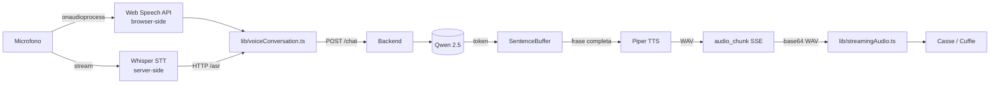

# Cap 7 — Voce, TTS, STT

> *Sintesi 30 secondi.* CARA parla con voce sintetizzata Piper (server)
> e ascolta con Web Speech (browser) o Whisper (server). Le frasi
> sintetizzate arrivano al browser via SSE in chunk audio sequenziali,
> così l'utente sente Cara che inizia a parlare ~2 secondi dopo aver
> chiesto, mentre il modello sta ancora generando il resto.

## 7.1 Architettura voce



Tre componenti distinti:

- **STT (speech-to-text)**: due opzioni, una browser-side (Web Speech)
  e una server-side (Whisper)
- **TTS (text-to-speech)**: Piper, sempre server-side
- **Streaming**: il backend tagliuzza la risposta a frase e manda
  ciascuna sintetizzata, così l'utente non aspetta che tutto sia
  pronto

## 7.2 Piper TTS — dove vivono le voci

**Piper** è un TTS open-source che gira su CPU, senza GPU. Modelli
ONNX scaricati a runtime, voci italiane multiple disponibili.

**Voce di default**: `it_IT-paola-medium` (femminile, naturale, real-time
factor ~0.5x = sintetizza più veloce della velocità di lettura).

**Altre voci IT**: `it_IT-riccardo-x_low` (maschile economico),
`it_IT-paola-medium` (femminile, default), e varianti `low`/`x_low`
per ridotto carico CPU.

**Path delle voci**: `data/tts/piper/voices/<voice_id>.onnx` +
`<voice_id>.onnx.json`. Auto-scaricate al primo uso da
`https://huggingface.co/rhasspy/piper-voices/`.

**Modulo**: `cara/ai/tts/`:

- `service.py` — `TTSService` async-safe, cache Redis
- `engines/piper.py` — wrapper sul binary `piper`
- `normalizer.py` — sostituzione anglicismi (vedi 7.3)
- `anglicisms.yaml` — dizionario di ~300 prestiti italiani

## 7.3 Normalizzatore anglicismi

**Problema**: Piper italiano legge male le parole inglesi. "weekend"
suona "uìcend", "smartphone" suona "smartfòn", "manager" suona
"mànager".

**Soluzione**: prima di sintetizzare, sostituiamo ogni anglicismo
conosciuto con la sua trascrizione fonetica italiana.

**File**: `cara/ai/tts/anglicisms.yaml`. Esempio:

```yaml
tech_and_digital:
  - en: weekend
    it: uìkend
  - en: smartphone
    it: smàrtfon
  - en: email
    it: imèil
streaming:
  - en: streaming
    it: strìming
work_and_lifestyle:
  - en: manager
    it: mànager
```

~300 voci curate divise per dominio (tech, streaming, social, work,
brands).

**Override admin**: l'admin può aggiungere o sovrascrivere via
`/admin/tts/overrides` (UI dedicata). Es: aggiungere il cognome di un
amico ("Pedotoa" → "pedotò-a"). Hot-swap, nessun restart.

**Modulo**: `cara/ai/tts/normalizer.py:TTSNormalizer`:

```python
from cara.ai.tts.normalizer import get_global_normalizer

n = get_global_normalizer()
n.set_user_overrides({"pedotoa": "pedotòa"})  # hot-swap
text = n.normalize("Ciao Pedotoa, weekend in famiglia")
# → "Ciao pedotòa, uìkend in famiglia"
```

Word-boundary regex case-preservante (UPPER/Title/lower).

## 7.4 Sentence streaming — frasi durante la generazione

**Problema**: il modello genera 9 token/s. Una risposta di 100 token
ci mette ~11 secondi a finire. Far aspettare l'utente 11 secondi
prima di sentire la voce è una pessima esperienza.

**Soluzione**: tagliuzzo la risposta a frase (`.`, `!`, `?`, `\n`),
sintetizzo ognuna appena completa, mando l'audio al frontend mentre
il modello continua. Prima frase parte in ~2 secondi.

**Modulo**: `cara/api/v1/_chat_tts_stream.py`.

### `SentenceBuffer`

Logica pure-Python che riceve token uno alla volta e ritorna le frasi
complete:

```python
from cara.api.v1._chat_tts_stream import SentenceBuffer

buf = SentenceBuffer()
for token in stream:
    sentence = buf.feed(token)
    if sentence is not None:
        # sentence è una frase intera, pronta per TTS
        await synthesize_sentence(sentence)
```

**Regole boundary**:
- Termine: `.`, `!`, `?`, `\n`
- **MIN_CHARS=6**: "Sì." non viene emesso da solo (troppo corto, suona
  spezzato); "Va bene." sì
- **MAX_CHARS=400**: hard ceiling per evitare frasi lunghissime
- **Abbreviazioni IT** non triggerano: `es.`, `Sig.`, `Dr.`, `ecc.`,
  decimal `1.5`

### Audio chunk SSE

Per ogni frase completa, il backend manda un evento SSE custom:

```
event: audio_chunk
data: {"seq":3,"text":"Va bene, ti aggiungo la pasta in lista.","audio":"<base64>","voice_id":"it_IT-paola-medium"}
```

Il frontend `streamingAudio.ts` riceve, decodifica base64, converte a
AudioBuffer, mette in coda WebAudio.

### Flag di abilitazione

`admin_settings.tts_streaming_enabled` controlla se il backend usa
streaming sentence-by-sentence o aspetta tutto. Default ON post-v1.0.

Se disattivato, la risposta arriva tutta come token stream e il
frontend chiama `/voice/synthesize` una volta sola alla fine.

## 7.5 Whisper STT — server-side

**Modulo**: `cara/api/v1/asr.py` espone `POST /asr/transcribe` che
riceve audio (multipart) e ritorna testo.

**Modello**: Whisper (small / medium) cached in `data/whisper-cache/`.
Auto-scaricato dal primo uso (~600 MB).

Il modello gira su CPU (no NPU support per Whisper RK3588), quindi è
**lento** (~1-2x real-time). Usalo per:

- Note vocali asincrone ("registra un memo")
- Trascrizione di file audio caricati
- Quando Web Speech del browser non è disponibile (browser obsoleti,
  WebView limitate)

## 7.6 Web Speech API — browser-side (default)

**Vantaggio**: è gratis, già integrato in Chrome/Safari/Edge, latenza
sub-secondo, supporta italiano nativo.

**Svantaggio**: Web Speech invia l'audio a un servizio cloud del
browser (Google in Chrome). Se vuoi privacy assoluta usa Whisper.

**Modulo frontend**: `frontend/src/lib/speech.ts` wrapper su
`SpeechRecognition`.

**Configurazione utente**: `admin_settings.voice_recognition_enabled`
master switch; pref per-utente in localStorage.

## 7.7 Wake word "CARA"

**Cosa è**: Cara può ascoltare in continuazione e attivarsi solo
quando senti "Cara". Senza wake word, devi premere il pulsante
microfono.

**Come funziona**: Web Speech in `continuous: true` mode → il
frontend filtra i risultati cercando "cara" all'inizio → quando
matcha, taglia il prefisso e manda il resto come query a `/chat`.

**Modulo**: `frontend/src/lib/voiceConversation.ts`. FSM:

```
idle → ascolto continuo → "Cara, accendi la luce"
                                  ↓
                          listening → STT in corso
                                  ↓
                          thinking → LLM genera
                                  ↓
                          speaking → TTS riproduce
                                  ↓
                          idle (di nuovo)
```

**Default OFF**: `wake_word_enabled=false` di default per non drenare
batteria mobile e per privacy. L'admin lo abilita via
`SettingsPage` o setup wizard step 4.

**Limitazione**: su iOS Safari, `continuous=true` ha bug noti — la
sessione si interrompe ogni 60 secondi. Il wrapper riavvia
automaticamente, ma c'è un piccolo gap. iOS-only fix è atteso.

## 7.8 WebAudio queue per playback

**Problema**: il backend manda chunk audio come WAV separati. Se li
suoni con `<audio>.play()`, c'è un gap fra uno e l'altro (~50-100ms)
audibile come singhiozzo.

**Soluzione**: `frontend/src/lib/streamingAudio.ts` usa l'API
WebAudio per schedulare ogni chunk al tempo esatto in cui finisce il
precedente. Zero gap, audio continuo.

```typescript
import { StreamingAudioPlayer } from '@/lib/streamingAudio';

const player = new StreamingAudioPlayer();
// ...nel handler SSE...
if (event.event === 'audio_chunk') {
  const wav = base64Decode(event.data.audio);
  player.enqueue(wav);  // suona quando arriva il turno
}
player.onComplete(() => console.log('done speaking'));
```

Il player tiene un cursor `nextStartTime` aggiornato a ogni `enqueue`:
`audioContext.currentTime + sum(durate precedenti)`. Robusto a chunk
che arrivano in ritardo (rete lenta).

## 7.9 Anteprima vocale — `/voice/voices` e `/voice/synthesize`

Tre endpoint utili:

```
GET /api/v1/voice/voices       — lista voci installate
GET /api/v1/voice/default       — voce di default
POST /api/v1/voice/synthesize   — sintetizza un testo, ritorna WAV
```

L'endpoint `/voice/synthesize` accetta `{text, voice_id?}`. Cache
Redis per 1 ora — frasi identiche ritornano dal cache senza ri-sintesi.

Usato dal setup wizard (step 4) per "Anteprima voce" — clicchi e senti
come suona la voce scelta.

## 7.10 Errori comuni e troubleshooting

| Sintomo | Causa | Risoluzione |
|---|---|---|
| `voice.synthesize` ritorna 503 | Piper non caricato | Controlla che `data/tts/piper/voices/it_IT-paola-medium.onnx` esista |
| Audio "sega" / interrotto | Web Speech non `continuous` | Aggiorna browser; se mobile, attiva wake word |
| Suona inglese su parole IT | Piper non normalizzato | Verifica che `anglicisms.yaml` sia caricato |
| Prima sintesi lenta (>5s) | Cold start Piper | Normale; warming up al primo uso |
| Whisper fallisce | Modello non scaricato | Aspetta ~3 min al primo asr call (download HuggingFace) |
| Wake word non scatta | `voice_recognition_enabled=false` | Abilita in `/settings` |

## 7.11 Estendere — aggiungere una voce

```bash
# Scarica una nuova voce Piper
cd /opt/cara/data/tts/piper/voices/
curl -L -o it_IT-riccardo-x_low.onnx \
  https://huggingface.co/rhasspy/piper-voices/resolve/main/it/it_IT/riccardo/x_low/it_IT-riccardo-x_low.onnx
curl -L -o it_IT-riccardo-x_low.onnx.json \
  https://huggingface.co/rhasspy/piper-voices/resolve/main/it/it_IT/riccardo/x_low/it_IT-riccardo-x_low.onnx.json

# Verifica che CARA la veda
curl -sk https://192.168.1.23:8455/api/v1/voice/voices
# Deve includere "it_IT-riccardo-x_low"
```

Nessun restart richiesto. La voce diventa selezionabile da
`SettingsPage` per ogni utente.

Per **aggiungere overrides** anglicismi a livello globale: edita
`cara/ai/tts/anglicisms.yaml`, restart backend. A livello admin
(senza restart): vai su `/admin/tts/overrides` e aggiungi una entry
in dict.

---

[← Cap 6 AI/LLM](06-ai-llm.md) · [README](README.md) · [Cap 8 Memoria →](08-memoria.md)
