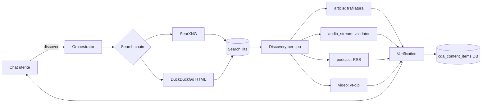

# Cap 13 — CDA (Content Discovery Agent)

> *Sintesi 30 secondi.* Quando dici "trovami una ricetta delle lasagne"
> o "metti una radio jazz", CARA non ha quei contenuti hardcoded —
> li scopre cercando sul web. CDA è l'orchestrator: usa SearXNG +
> DuckDuckGo, estrae con trafilatura, verifica i link, persiste in
> KB. Tutto opt-in tramite `internet_enabled=true`.

## 13.1 Perché un Discovery Agent

Hardcoded → noioso. Una lista di stazioni radio precompilata invecchia
in due mesi. Un set di feed RSS muore quando i siti cambiano CMS. CARA
**deve** poter scoprire contenuti nuovi a runtime.

CDA risolve questo con un pipeline:

```
1. Search          → SearXNG / DuckDuckGo per la query
2. Discovery       → Estrai per tipo: article, podcast, video, audio_stream
3. Verification    → Verifica che l'URL funzioni davvero (HEAD/GET di test)
4. Persistence     → Salva in cda_content_items con confidence
5. Selection       → Ritorna il top item all'utente
```

Tutto opt-in. `cda_enabled=false` di default in produzione famiglia
con bambini; `cda_enabled=true` con `cda_safe_search_for_minors=true`
per safe search forzata sui ruoli child/teen.

## 13.2 Tipi di contenuto

`ContentType` enum in `cara/cda/base.py`:

| Tipo | Esempio | Estrattore |
|---|---|---|
| `article` | Articolo testuale (news, blog, ricetta) | trafilatura + regex fallback |
| `audio_stream` | Stream audio diretto (radio internet) | URL validator + ICY metadata |
| `podcast` | Episodio podcast | RSS parser + audio enclosure |
| `video` | Video (YouTube, Vimeo) | yt-dlp opt-in + oEmbed |
| `image` | Immagine standalone | URL validator + metadata |
| `document` | PDF, DOCX | content-type sniff |

Ognuno ha un modulo dedicato in `cara/cda/discovery/`.

## 13.3 Architettura — orchestrator + provider + verifier



**Modulo principale**: `cara/cda/orchestrator.py`. Funzione
`discover(session, request)`:

```python
from cara.cda import discover, DiscoverRequest

result = await discover(
    session,
    DiscoverRequest(
        user_id=user.id,
        raw_query="ricetta lasagne",
        content_type="article",
        modifiers={},  # es. {"language": "it", "min_duration": 600}
    ),
)
# Discovery(url, title, source_domain, content_type, extra={"text": ...})
```

## 13.4 Search providers

**File**: `cara/cda/search/`.

### SearXNG (preferito)

SearXNG è un meta-search engine self-hosted. CARA punta a
`https://searxng.tutorialfm.com/` di default (un'istanza pubblica
solida) ma puoi self-hostare la tua e cambiare `CDA_SEARXNG_URL` in
`.env`.

Pro:
- Aggrega 70+ engine (Google, Bing, DuckDuckGo, Wikipedia, Mojeek)
- API JSON pulita
- No rate limit aggressivo se usato moderate
- Privacy: non logga query

Con:
- Dipende dall'istanza pubblica se non self-hosted

### DuckDuckGo HTML (fallback)

Se SearXNG non risponde, fallback su scraping del `https://html.duckduckgo.com/html/`.
Brittle ma funziona quando serve.

### Chain

`cara/cda/search/chain.py` itera i provider in ordine, prima quello
disponibile. Errori swallowed; se tutti falliscono, ritorna lista vuota
e l'utente vede "non ho trovato nulla".

## 13.5 Discovery per tipo

### Article

**File**: `cara/cda/discovery/article.py`.

Per ogni hit della search:
1. `httpx.get(hit.url)` → HTML
2. **trafilatura.extract()** se possibile (estrae main text + metadata)
3. **Regex fallback** se trafilatura fallisce: strip tag, prendi
   `<title>`, dedup, cap a 8000 char
4. Considera "valido" se il testo estratto ha ≥200 char

### Audio stream

**File**: `cara/cda/discovery/audio_stream.py`.

Per stream radio internet:
1. URL deve finire in `.mp3`, `.aac`, `.ogg` OPPURE rispondere con
   `Content-Type: audio/*`
2. ICY metadata fetch (header `Icy-Name`, `Icy-Genre`)
3. Verification: tenta una connessione di 3 secondi e rileva audio
   playable

### Podcast

**File**: `cara/cda/discovery/podcast.py`.

Per RSS feed di podcast:
1. Trova feed: l'hit ha "podcast" / ".rss" / "/feed" nel URL?
2. `feedparser.parse(url)` → episodi
3. Filtra per modifiers (`min_duration`, `language`, `since_date`)

### Video / Image / Document

Pattern simile, ognuno specifico.

## 13.6 Verification — il link funziona davvero?

**File**: `cara/cda/verification/`.

Due verifier:

- **`url_validator.py`** — HEAD request, Content-Type check,
  redirect handling
- **`stream_validator.py`** — per audio_stream, prova 3s di playback

Le Discovery non verificate vengono droppate. Cosi quando dici "metti
radio" non ti propone uno stream morto.

## 13.7 KB persistente — `cda_content_items`

Una volta verificato, il content viene salvato:

```python
class CDAContentItem(Base):
    id: UUID
    content_type: str
    url: str
    title: str
    source_domain: str
    extra: dict          # text, duration, ecc.
    confidence: float    # 0.0..1.0
    discovered_by_user_id: int | None
    discovered_at: datetime
    last_verified_at: datetime
    play_count: int      # quanti utenti l'hanno usato
    active: bool         # soft-delete
```

La KB serve due scopi:

1. **Cache**: query simili ritornano subito senza ricerca
2. **Sostituzione hardcoded**: con `cda_replace_legacy_pages=true`,
   le pagine `/news` e `/radio` leggono da KB invece di feed RSS
   hardcoded

### Confidence Bayesian

Ogni feedback utente aggiorna la confidence:

- `started` (utente ha aperto il link) → +0.1
- `stopped` quickly (chiuso in <30s) → -0.05
- `regenerated` (ha chiesto un altro) → -0.1
- `manual_pin` (admin "questo è buono") → +0.3

Item con confidence < 0.2 vengono auto-dropped al maintenance.

## 13.8 Maintenance — cleanup KB

**File**: `cara/cda/maintenance.py`.

Job batch ogni 6 ore:
1. Re-verifica tutti gli `audio_stream` attivi (i feed muoiono spesso)
2. Drop item con confidence < 0.2 e play_count < 3
3. Drop item con `last_verified_at` > 30 giorni e nessun re-verify
4. Aggiorna `play_count` da `cda_query_log`

Avviato da `cara/main.py:lifespan` automaticamente.

## 13.9 Endpoints REST

**File**: `cara/api/v1/cda.py`.

| Endpoint | Method | Cosa fa |
|---|---|---|
| `/cda/discover` | POST | Esegui un discovery on-demand |
| `/cda/items` | GET | Lista KB items (filtrabile) |
| `/cda/items/{id}/active` | PATCH | Admin: attiva/disattiva |
| `/cda/feedback/started` | POST | Utente ha aperto |
| `/cda/feedback/stopped` | POST | Utente ha chiuso |
| `/cda/feedback/regenerated` | POST | Utente ha chiesto altro |

## 13.10 Rate limiting — `cara.cda.rate_limit`

CDA è un fan-out a servizi esterni (SearXNG, DuckDuckGo, siti random).
Senza rate limit, una chat che richiama `discover` 5 volte di seguito
saturerebbe gli upstream.

Token bucket Redis-backed:

```python
from cara.cda.rate_limit import acquire_or_raise

await acquire_or_raise(
    redis, key="cda:user:42", capacity=10, refill_per_sec=0.5
)
# raises CdaRateLimitError se sopra il bucket
```

Default per utente: 10 token, refill 1 ogni 2 secondi (= ~30
discover/min sustained).

## 13.11 Privacy + safe search

`cda_safe_search_for_minors=true` (default) forza:
- Tutte le query da utenti con role `child` o `teen` passano per
  SearXNG con `safesearch=2` (strict)
- Domain blacklist `cda_domain_blacklist` (lista in admin_settings)
  filtra hit
- Per `child`, anche `cda_domain_whitelist_for_child` opzionale
  (allowlist)

> **🔒 Sicurezza** — il safe search è server-side. Non si bypassa dal
> client. Anche se l'utente sa l'URL, può accedere; ma CDA non glielo
> propone mai.

## 13.12 Tutorial — usare CDA da una skill

Una skill può chiamare la primitive `discover` per cercare contenuti
on-the-fly:

```json
{
  "name": "trova_canzone_buongiorno",
  "intent_examples": ["mi suggerisci una canzone per il buongiorno"],
  "slot_extraction": {},
  "plan": {
    "steps": [
      {"id": "find", "tool": "discover", "args": {
        "query": "canzone allegra italiana mattina",
        "kind": "audio_stream"
      }},
      {"id": "play", "tool": "play_radio_url", "args": {
        "url": "{find.url}"
      }}
    ]
  },
  "response_template": "Suono **{find.title}** da {find.source_domain}.",
  "fallback_response": "Non ho trovato una canzone giusta."
}
```

(Nota: `play_radio_url` è una primitive da scrivere — esempio.)

## 13.13 Estendere — aggiungere un provider search

Esempio: aggiungere Brave Search.

**1. Nuovo provider**:

```python
# cara/cda/search/brave.py
import httpx
from cara.cda.search.base import SearchProvider, SearchHit

class BraveSearchProvider:
    name = "brave"

    def __init__(self, api_key: str):
        self._key = api_key

    async def search(self, query: str, max_results: int = 10) -> list[SearchHit]:
        headers = {"X-Subscription-Token": self._key}
        async with httpx.AsyncClient(timeout=8.0) as client:
            r = await client.get(
                "https://api.search.brave.com/res/v1/web/search",
                params={"q": query, "count": max_results},
                headers=headers,
            )
            r.raise_for_status()
            data = r.json()
        hits = []
        for item in data.get("web", {}).get("results", []):
            hits.append(SearchHit(
                url=item["url"],
                title=item["title"],
                snippet=item.get("description", ""),
                source_domain=item.get("netloc", ""),
            ))
        return hits
```

**2. Inseriscilo nella chain**:

```python
# cara/cda/search/chain.py
def build_chain(settings):
    chain = []
    if settings.get("brave_api_key"):
        chain.append(BraveSearchProvider(settings["brave_api_key"]))
    chain.append(SearXNGProvider(...))
    chain.append(DDGProvider())
    return chain
```

**3. Config**: aggiungi `BRAVE_API_KEY` env e `brave_api_key` in
`admin_settings.DEFAULTS`.

## 13.14 Errori comuni

| Sintomo | Causa | Risoluzione |
|---|---|---|
| `discover` ritorna 503 | `cda_enabled=false` | Abilita in admin settings |
| Stream radio non parte | Feed morto | Maintenance dovrebbe purgarlo; force `re-verify` admin |
| Risultati ripetuti | KB cached | Force refresh: `cda_force_refresh=true` (futuro) |
| Rate limit hit | Troppe query simultanee | Aumenta `CDA_RATE_LIMIT_CAPACITY` |
| `safe_search` lascia passare contenuti adulti | SearXNG non rispetta safesearch | Cambia istanza SearXNG (alcune ignorano il flag) |

---

[← Cap 12 Smart home](12-smart-home.md) · [README](README.md) · [Cap 14 Workflow →](14-workflow.md)
