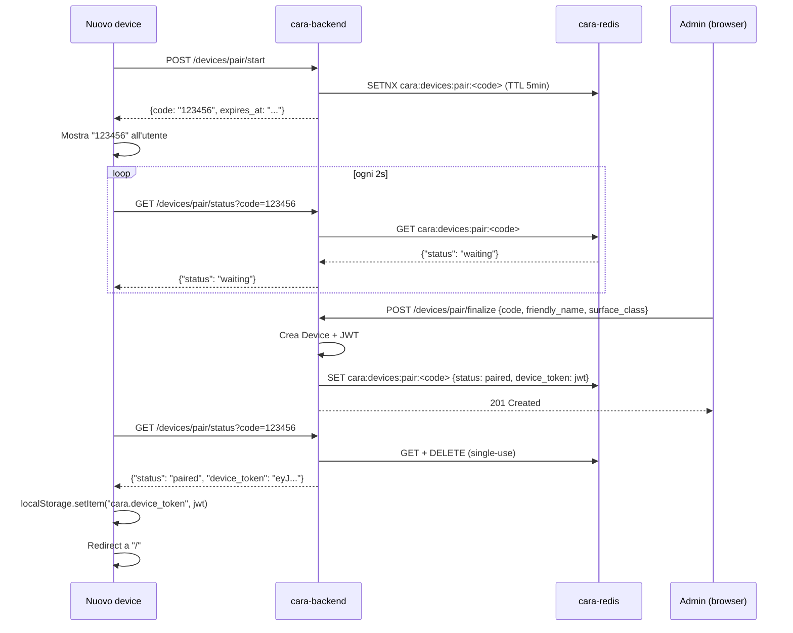

# Cap 15 — Multi-device + pairing

> *Sintesi 30 secondi.* Più dispositivi della famiglia possono usare
> CARA: telefoni, PC, una tablet wall in cucina, un orologio. Ognuno
> si registra via flow di pairing a 6 cifre: codice mostrato sul
> nuovo device, l'admin lo digita su `/admin/devices`, il backend
> emette un JWT lungo termine. Le surface (mobile/desktop/wall/watch/tv)
> determinano densità del Wallet e capability.

## 15.1 Cosa è un device

Un **device** è un client paired con CARA che ha il suo JWT a lungo
termine (1 anno). Diverso dall'utente: un utente può avere più
device (telefono + tablet + wall), e un device può essere usato da
più utenti famiglia (la wall in cucina è di tutti).

**Modello**: `cara/models/device.py`.

```python
class Device(Base):
    id: UUID
    friendly_name: str          # "Wall soggiorno", "iPhone Antonio"
    surface_class: str          # "wall"|"mobile"|"desktop"|"watch"|"tv"
    capabilities: dict          # {"camera": true, "mic": true, "speaker": true}
    location: str | None        # "soggiorno"
    config: dict                # per-device feature flags
    status: str                 # pending|online|offline|disabled|error
    enabled: bool
    device_token: str | None    # JWT lungo termine
    paired_by_user_id: int | None
    paired_at: datetime
    last_seen: datetime | None
```

## 15.2 Surface — cosa cambia

Il `surface_class` determina:

| Surface | Wallet cap | UI density | Voice always-on |
|---|---|---|---|
| `mobile` | 4 widget | medium | opt-in |
| `desktop` | 6 widget | low (più spazio) | opt-in |
| `wall` | 8 widget | high (kiosk-like) | sì, default |
| `watch` | 2 widget | tiny | sì in burst |
| `tv` | 4 widget | XL (vista a 3m) | opt-in |

Il backend usa `surface_class` per:
- Filtrare widget capability (cap 10.3)
- Layout default per ruolo (cap 10.5)
- Per-surface push routing (es. notifiche silenziate sulla `tv`)

## 15.3 Pairing flow — codice 6 cifre

Lo schema:



5 step:

1. **Start**: nuovo device chiama `POST /devices/pair/start` (anonimo).
   Backend genera codice 6-digit random, salva in Redis con TTL 5
   minuti.
2. **Polling**: nuovo device chiama `GET /devices/pair/status?code=...`
   ogni 2 secondi. Fino a quando l'admin non finalizza, ritorna
   `{status: waiting}`.
3. **Finalize**: l'admin nel suo browser apre `/admin/devices`, clicca
   "+ Aggiungi", digita il codice + friendly_name + surface_class.
   Backend crea Device row, mints JWT, mette JWT nel Redis ticket.
4. **Pickup**: il nuovo device polling vede `{status: paired,
   device_token: ...}`. Salva il JWT in localStorage. Il Redis ticket
   si auto-cancella dopo il primo read (single-use).
5. **Use**: tutte le richieste future dal device usano `Authorization:
   Bearer <jwt>`.

### Codice 6 cifre

`secrets.randbelow(10**6)` zero-padded. ~1 milione di possibili codici.
Con TTL 5 min e rate limit, brute force impractical:

- Per indovinare un codice attivo: 1/1.000.000 = 0.0001% per tentativo
- Rate limit 5 tentativi / 5 min per IP → 1 tentativo / minuto
  effettivo
- Per coprire 50% dei codici (mediana brute force): 500.000 tentativi
  → 500.000 minuti = 11 anni

> **🔒 Sicurezza** — il codice è single-use. Una volta `finalize`,
> il Redis ticket diventa `paired`, e il primo `status` poll lo
> consuma. Replay è impossibile.

### TTL 5 minuti

Bilancio fra:
- Troppo corto (es. 1 min): l'admin non fa in tempo ad arrivare al
  PC dell'altra stanza
- Troppo lungo (es. 1 ora): codici abbandonati riempiono Redis e
  brute force diventa marginalmente più pratico

5 minuti è il default. Configurabile via `PAIR_TTL_SECONDS` in
`cara/services/devices.py`.

## 15.4 Endpoint REST

**File**: `cara/api/v1/devices.py`.

| Endpoint | Method | Auth | Cosa fa |
|---|---|---|---|
| `/devices/pair/start` | POST | anon | Genera codice |
| `/devices/pair/status?code=` | GET | anon | Polling |
| `/devices/pair/finalize` | POST | admin | Bind code → Device |
| `/devices/heartbeat` | POST | device | Mark online (optional) |
| `/devices` | GET | admin | Lista |
| `/devices/{id}` | GET | admin | Detail |
| `/devices/{id}` | PATCH | admin | Rename / change surface / enable |
| `/devices/{id}` | DELETE | admin | Deauth + cancella |

## 15.5 Frontend — `/pair` e `/admin/devices`

### `/pair` (anonimo)

**File**: `frontend/src/routes/PairPage.tsx`.

Pagina che il nuovo device apre per ottenere il JWT. Auto-detect
surface (mobile vs desktop) dal viewport. Genera il codice, polling,
salva il token quando arriva, redirect a `/`.

Il design è essenziale: numero grande monospace, "tieni d'occhio
questa pagina, vai sull'altro device a digitare il codice".

### `/admin/devices`

**File**: `frontend/src/routes/AdminDevicesPage.tsx`.

Lista paired devices. Per ogni device: card con nome, surface,
location, last_seen, status. Azioni:

- **Modifica** → rename, change surface_class, location
- **Disabilita** / **Abilita** → toggle `enabled`
- **Cancella** → confirmation, deauth + DELETE

Pulsante **"+ Aggiungi"** apre modal con: campo codice 6 cifre,
nome, surface dropdown, location.

## 15.6 Heartbeat — keep-alive

Il device può chiamare `POST /devices/heartbeat` (con il suo JWT)
per dichiararsi online. Aggiorna `last_seen` e `status=online`.

Optional: senza heartbeat il device resta nel suo last status. La
wall in cucina che si stacca da sola finché qualcuno non torna a
toccarla resta `online` finché il backend non vede uno timeout
(non implementato; ATM `online` resta finché la riga non viene
modificata).

## 15.7 Deauth

`DELETE /devices/{id}` esegue:

1. `device.device_token = None` — il JWT non corrisponde più alla riga
2. `device.status = disabled`
3. `device.enabled = False`
4. `session.delete(device)` — cancella la riga

Il JWT a vita era valido per 1 anno. Dopo deauth:
- I JWT verifier rifiutano i token che non matchano una row attiva
- (Migliore: aggiungere check `Device.device_token == jwt_token`
  nell'auth dependency — al momento NON implementato per i device
  token. I device si trustano dal puro JWT validity)

> **⚠️ Attenzione** — al momento il revoke di un device JWT è
> "soft": il token resta crittograficamente valido fino allo
> `exp`. Se vuoi revoke immediate dopo furto/perdita, devi cambiare
> `JWT_SECRET` (forza re-login di tutti gli utenti) o aggiungere
> token blocklist (futuro).

## 15.8 Multi-utente sullo stesso device

La wall in cucina serve tutta la famiglia. Come distinguere chi sta
parlando?

**Oggi**: la wall ha il suo JWT device. Per le richieste personali
("quali sono le mie task?"), c'è un fallback: l'utente "default" della
wall è l'admin (Antonio). Altri utenti devono fare login esplicito
sulla wall (UI pulsante "Cambia utente").

**Futuro**:
- Riconoscimento facciale (frigate-faces) per auto-login
- Wake word personalizzato per utente ("Cara, sono Sara...")
- Voce-print per identificazione speaker

## 15.9 Family bus — sync cross-device

Quando uno crea una task da iPhone, la wall deve aggiornarsi senza
refresh. Soluzione: family bus via Redis pub/sub + WebSocket.

**Backend**:
- `cara.services.family_bus` pubblica eventi su Redis channel `cara:family:default`
- `cara/api/v1/family_ws.py` espone `WS /api/v1/family/ws?token=<jwt>` che subscribe e fa fan-out al client

**Frontend**:
- `lib/familySync.ts` apre la WS, riceve eventi, dispatcha hooks (es.
  `useTasks` re-fetch su `task.created`)

**Topics standard**:
- `task.created`, `task.updated`, `task.deleted`, `task.completed`
- `shopping.added`, `shopping.bought`
- `note.created`
- `proposal.new` (email proposal)
- `chat.turn` (chi sta chattando in casa)

Vedi cap 17 per dettagli.

## 15.10 Tutorial — pair una nuova wall

Antonio compra un Raspberry Pi 5 + touchscreen e vuole installarlo come
wall in cucina.

**1. Sul Pi 5**:
- Boot RaspberryPiOS, installa Chromium kiosk mode
- Apri `https://192.168.1.23:8455/pair` automaticamente al boot
- Vede codice 6 cifre

**2. Sul telefono di Antonio (admin)**:
- Apri CARA → `/admin/devices` → "+ Aggiungi"
- Digita codice
- Friendly name: "Wall cucina"
- Surface: `wall`
- Location: "cucina"
- Conferma

**3. Sul Pi 5**:
- Polling vede `paired`, salva JWT
- Redirect a `/` → mostra Wallet con preset wall
- Antonio configura il Wallet della wall come vuole (drag widget)

**4. Optional — abilita auto-login facciale**:
- Configura frigate-faces a riconoscere chi entra in cucina
- CARA leggerà chi è presente per personalizzare risposte

## 15.11 Errori comuni

| Sintomo | Causa | Risoluzione |
|---|---|---|
| Codice scade prima del finalize | TTL 5 min superato | Genera nuovo codice (PairPage ha pulsante "Rigenera") |
| Status sempre `waiting` | Admin non ha finalizzato | Verifica `/admin/devices` aperto |
| `pair/start` ritorna 503 | Redis offline | `docker compose ps` + restart Redis |
| Token funziona ma `/devices/heartbeat` 401 | Mismatch device_token DB vs JWT presentato | Re-pair il device |
| Wall mostra UI mobile | Surface auto-detect sbagliata | Imposta manualmente surface_class via PATCH |

## 15.12 Estendere — surface watch (Apple Watch / Wear OS)

Il software lato CARA è già pronto: `surface_class=watch`, cap 2
widget, layout preset elder/teen. Manca solo l'app nativa watch
(WatchKit / Wear OS) o una WebApp ottimizzata.

Se decidi di farla:
1. PWA installata su Apple Watch funziona ma con limitazioni Safari
   embedded — UI deve essere supersemplice (1 widget visibile, swipe
   per il prossimo)
2. WatchKit nativo richiede iOS app companion sull'iPhone — non
   abbiamo iOS app oggi, è una scelta di prodotto
3. La pair flow è la stessa: il watch mostra il codice (anche solo come
   testo grande), l'admin lo digita su `/admin/devices`

Surface caps + Wallet già supportano `watch` correttamente. È solo
una questione di UI nativa.

---

[← Cap 14 Workflow](14-workflow.md) · [README](README.md) · [Cap 16 Integrazioni Google →](16-integrazioni-google.md)
